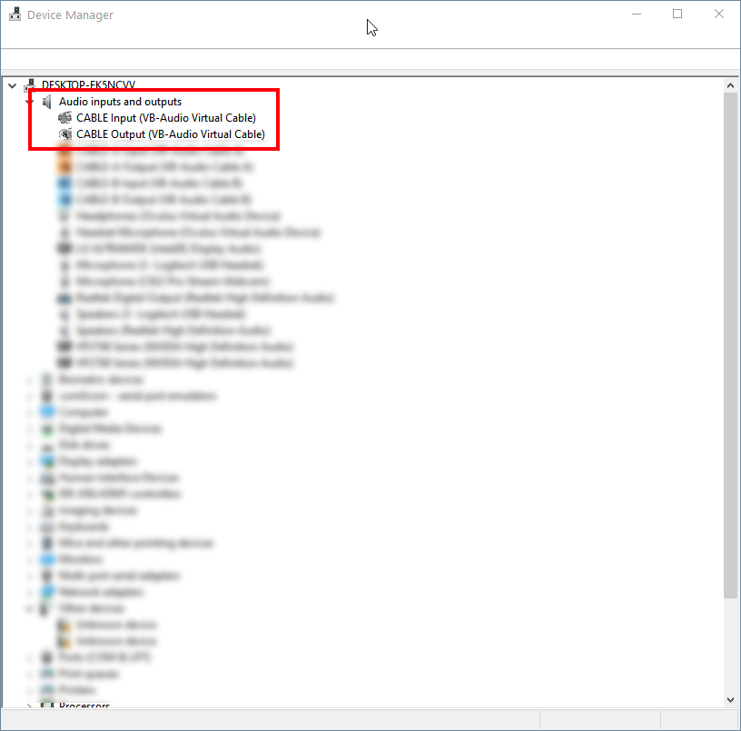
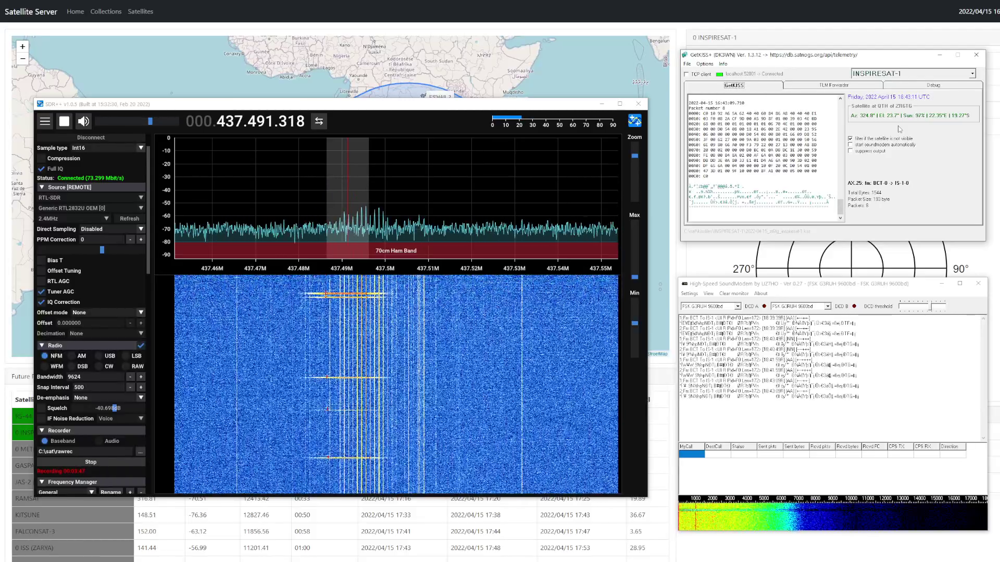

============================================
Satellite Telemetry Tracking/Decoding Part 1
============================================

Introduction
++++++++++++

There is so much more you can do with amateur radio satellite than just making contacts. Lots of them carry a variety of interesting experiments and transmit their telemetry on a regular basis. A part of this hobby is tracking these satellites and receiving and decoding the telemetry.
This is not only fun, but if the telemetry gets passed along to the satellite owner then it gives them an opportunity to receive more data points. This tutorial shows a basic way of tracking and receiving telemetry from satellites. As with most aspects of our hobby there are various ways to do this.
Lots of different hardware and software available with similar capabilities, but the general flow is similar. Give it a try, you might find that this is another aspect of our wonderfull hobby you can enjoy.

Requirements
++++++++++++

.. list-table:: 
   :widths: 50 50
   :header-rows: 1

   *  - Hardware
      - Notes

   *  - SDR Device
      - Lots of options available, a basic RTL-SDR is adequate
   *  - Antenna
      - 70cm Band Turnstile or Yagi is recommended

.. list-table:: 
   :widths: 50 50 50
   :header-rows: 1

   *  - Software
      - Notes
      - Link
   *  - SDR Software
      - | Depends a lot on the sdr you use. For this tutorial 
        | we will be using sdr++ which supports a variety of 
        | sdr devices
      - https://github.com/AlexandreRouma/SDRPlusPlus
   *  - Satellite Prediction Software
      - | Lots of options available, we will be using Gpredict 
        | in this tutorial
      - http://gpredict.oz9aec.net/
   *  - Software TNC (High-Speed Soundmodem)
      - | A few options available, we will be using the hs 
        | soundmodem from UZ7H0, download
        | hs_soundmodem27.zip
      - http://uz7.ho.ua/packetradio.htm
   *  - Virtual Audio Cable
      - Basic free version is sufficient
      - https://vb-audio.com/Cable/index.htm

Setup
+++++

Virtual Audio Cable
===================

Virtual audio cable is the link between our sdr receiver software and our soundmodem. Think of it as an audio cable, we will be configuring our sdr receiver to output the audio on the virtual audio cable, and the input on our soundmodem will also be on the same audiocable.

Once you have installed virtual audio cable you should have the following devices available:

SDR Receiver
============

Since there are multiple sdr receivers with their various software, we won't be diving too much into the configuration as it will most likely be different for you. 

We have the following requirements for our sdr receiver

* **Connect to our SDR Hardware device (for example the RTL-SDR)**
* Configure the audio output of our sdr receiver to our virtual cable. If you are following along with SDR++ then it would look like this:
    .. image:: images/vac_sdr.png
        :width: 600
        :align: center
* Some way of controlling the frequency automatically to compensate for the doppler effect. SDR++ has a module built in for a RigCtl server. This simply means that other RigCtl compatible software can send a frequency setting to the sdr software and it will automatically tune to the new frequency. Our satellite prediction software (Gpredict) will be connecting to our sdr software and control the frequency during the satellite pass. In SDR++ the rigctl is simple and would look like this:
    .. image:: images/rigctl_sdr.png
        :width: 600
        :align: center

HS SoundModem
=============

The soundmodem software decodes our received signal into packets of data. These packets of data can contain telemetry data, images, etc. It all depends on the mission of the satellite.

    .. image:: images/soundmodem.png
        :width: 600
        :align: center

Soundmodem can both receive and transmit packets. For this tutorial we only care about receiving. You can leave most settings on default but the important part is to make sure out audio input is our virtual cable (Settings->Devices):

    .. image:: images/soundmodem_devices.png
        :width: 600
        :align: center

The other settings you can check is the modem settings. This should be all default (Settings->Modems):

    .. image:: images/soundmodem_modems.png
        :width: 600
        :align: center

Gpredict
========

    .. image:: images/gpredict.png
        :width: 600
        :align: center

Gpredict is a real-time satellite tracking and orbit prediction application. We will be using this for tracking our satellite and also use its radio control functionality to control our sdr receiver. If you are using this for the first time then you need to do the following:

* Configure your location. To be able to predict when a satellite will be in view of your QTH it needs to know where your location is. (Edit->Preferences->Ground Stations)

    .. image:: images/gpredict_location.png
        :width: 600
        :align: center

* Update your TLE files. TLE files contains the properties of the satellite orbit. Gpredict comes default with various sources for TLE files (Edit->Preferences->TLE Update) but you can add your own sources if you need to:

    .. image:: images/gpredict_tle_sources.png
        :width: 600
        :align: center

* To download and update your TLE files use the (Edit->Update TLE from Network) menu option to download and update your TLE files

    .. image:: images/update_tle.png
        :width: 600
        :align: center

* An extra feature is that Gpredict can show a list of the radios on a specific satellite if that information is available. To update that list, use the (Edit->Update Transponder Data) menu option

    .. image:: images/gpredit_transponder.png
        :width: 600
        :align: center

* Now we can configure satellites you want to track. Click on the down arrow on the top right corner and select configure. This will allow you to configure satellites for the currently active module. 

    .. image:: images/gpredict_configure1.png
        :width: 600
        :align: center

* You will be able to search for various satellites and select them by moving them into the right box. You can add multiple satellites.

    .. image:: images/gpredict_configure2.png
        :width: 600
        :align: center

* The satellites you added should now be showing on your map and you will be able to see when the next pass comes along

    .. image:: images/gpredict_satellite.png
        :width: 600
        :align: center

* The last configuration we want to do is to configure Gpredict to control the frequency of our SDR Receiver. This will vary depending on your SDR software, but for SDR++ we can configure this going to the  (Edit->Preferences->Interfaces) menu. Click on new and use the following Settings-

    .. image:: images/gpredict_radio_control.png
        :width: 600
        :align: center

Showtime
++++++++

Right, that was quite a bit of configuration to do, but we should now be ready to start tracking and decoding some satellites. The general process is as follow:

#. Decide on which satellite to track and look up the next pass
#. Start your sdr receiver software
#. Start the hs_soundmodem software
#. Start Gpredict
#. Start radio control in Gpredict (Top Right Arrow -> Radio Control)
    .. image:: images/gpredict_radio_select.png
        :width: 600
        :align: center
#. Make sure correct protocol is selected for this satellite
#. Wait for satellite pass to start (ie, in view of your qth). If the satellite is operational and transmitting then you should see the packets it transmits in the SDR receiver. Depending on the satellite it can be at various intervals. 
#. If a packet is received then the data for that packet should show in your hs_soundmodem application

|
| Congratulations, you have successfully tracked and received the telemetry from a satellite!
|

.. raw:: html

    
<iframe width="560" height="315" src="https://www.youtube.com/embed/LqXC46kMyEE" title="YouTube video player" frameborder="0" allow="accelerometer; autoplay; clipboard-write; encrypted-media; gyroscope; picture-in-picture" allowfullscreen></iframe>

.. warning::
    There is quite a lot involved in doing all of the above, and you aren't guaranteed that the satellite is actually transmitting. Don't be disheartened if your first few attempts aren't successful. It took me a while to get this going and I'm still learning. As with any hobby it takes some practice and a bit of luck, but its incredibly rewarding when you receive and decode those packets.

    I have compiled a list of Radio Amateurs who track and decode satellites and share this info on twitter. Its a good reference of satellites that active and new  `Satellite Telemetry Hunters <https://twitter.com/i/lists/1513934221525540874>`_

What is next ?
++++++++++++++

There are lots of things you can do next with this data. Part 2 of this tutoral will be available soon and will show how to share this data with the satnogs database, and also show how to decode the gibberish you have received into meaningfull satellite telemetry. Stay Tuned!

