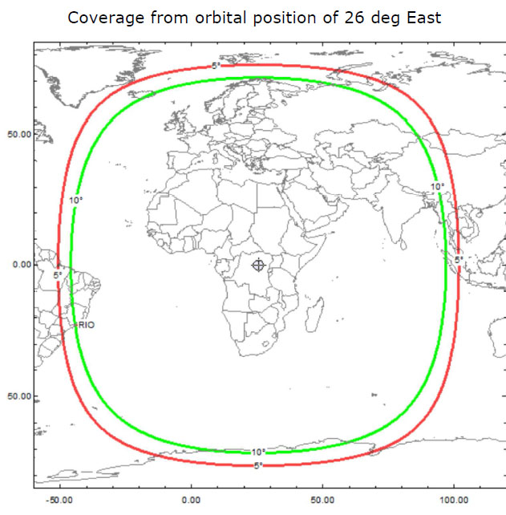

===============
Qatar-OSCAR 100
===============

The OSCAR 100 is an amateur radio transponder located on the Es'hail-2 satellite. It was a joint project by the Qatar Satellite Company, Qatar Amateur Radio Society and AMSAT 
Deutschland. It was launched in 2018 and the current position is 26 Deg East. It consists of two sections; the narrowband transponder with a bandwidth of 250 kHz and the wideband
transponder with a bandwidth of 8 MHz. The satellite has an uplink (the freq we transmit on) in the 2.4GHz range and a downlink (the freq we listen on) in the 10Ghz range. The challenge with working this satellite is that your 
typical amateur radio's don't cover these bands. 

The satellite has a huge footprint and allows for lots of dx contacts.

The recommendation is to start by receiving the narrow band transponder and then depending on your interests move on to transmitting. Once you have the narrowband going then only then
would I recommend refining your station for the wideband transponder.

.. toctree::
    :maxdepth: 10
    :caption: Contents:

    eshail_dish.rst
    eshail_narrowband.rst
    eshail_wideband.rst
