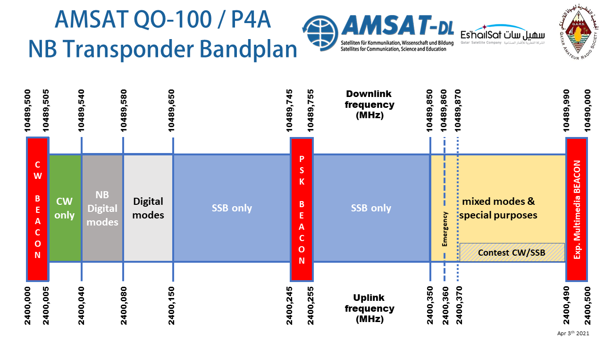

======================
Narrowband Transponder
======================

Resources
=========

| `Bandplan Information and Operating Guidelines <https://amsat-dl.org/en/p4-a-nb-transponder-bandplan-and-operating-guidelines/>`_
| `Qatar-OSCAR 100 Narrowband WebSDR <https://eshail.batc.org.uk/nb/>`_

Receiving
+++++++++

Hardware Options
================

   .. list-table:: 
      :widths: 25 75
      :header-rows: 0

      *  - Satellite Dish 
         - | Recommended to start with atleast an 80cm dish, 
           | go for bigger if you plan to use the wideband 
           | transponder in the future.
      *  - LNB
         - | You want a PLL based LNB 
           | (In South Africa a newer model lnb used for DSTV 
           | works just fine to start with)
      *  - Bias-T
         - | This provides power to your LNB 
           | (Different voltages can switch the polarization) 
      *  - SDR or DownConverter + Radio
         - | Your receiving side can be as simple as a rtlsdr, 
           | but consider getting an sdr with transmit capabilities 
           | (For Example: PlutoSDR). 
           | A downconverter + Radio can also be used.

Transmitting
++++++++++++

Hardware Options
================

    The table below assumes you have all the receiving hardware and only want to add to it to start transmitting.

   .. list-table:: 
      :widths: 25 75
      :header-rows: 0

      *  - SDR or UpConverter + Radio
         - | SDR must have transmit capabilities
           | An upconverter + Radio can also be used.
      *  - Pre Amplifier
         - | Most SDR's have a very low power output
           | Depending on your amplifier you might 
           | need a pre-amplifier
      *  - Amplifier
         - | 1w-5w depending on your dish size. 
           | 3w on 80cm dish works perfectly
      *  - Antenna
         - | Poty or Helical
           | Lots of DIY options eg. `Ice Cone feed <https://www.qrz.com/db/DC8PAT>`_
           
