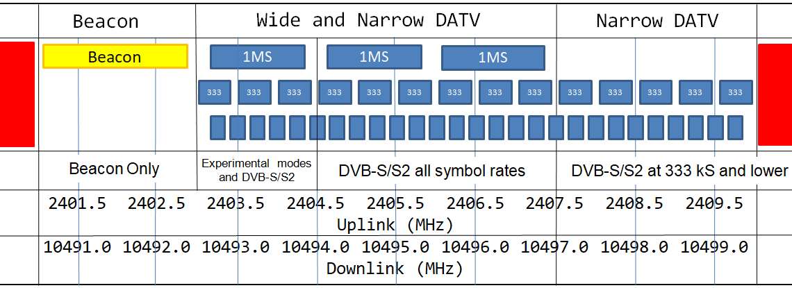

====================
Wideband Transponder
====================

Resources
=========

| `Bandplan Information and Operating Guidelines <https://amsat-dl.org/en/p4-a-wb-transponder-bandplan-and-operating-guidelines/>`_
| `Qatar-OSCAR 100 Wideband Spectrum Monitor <https://eshail.batc.org.uk/wb/>`_

Receiving
=========

To receive DATV on the wideband transponder on the QO-100 you need at minimum the following items:

   .. list-table:: 
      :widths: 25 75
      :header-rows: 0

      *  - Satellite Dish
         - | You will need a 80cm or bigger dish to receive DATV,
           | Consider going bigger if you want to eventually transmit
           | on the wideband transponder.
      *  - LNB
         - | A standard PLL LNB will do the job, it doesn't need to 
           | be GPS disciplined.
      *  - Bias-T
         - | This small circuit powers the LNB. Usually 12v for vertical
           | polarization and 18v for Horizontal polarization. You can 
           | also power it with 12v and just turn your lnb sideways.
      *  - `MiniTiouner <https://wiki.batc.org.uk/MiniTiouner_hardware_Version_2>`_
         - | Easy to build kit from BATC. Connects to your pc and using
           | the `Minitioune <https://wiki.batc.org.uk/MiniTioune>`_ software decodes and displays any received
           | DATV transmissions.
      *  - Software Demodulator
         - | A software alternative to MiniTiouner is available `here <https://forum.amsat-dl.org/index.php?thread/101-software-dvb-s-demodulator/&pageNo=1>`_
           | Your mileage may vary

