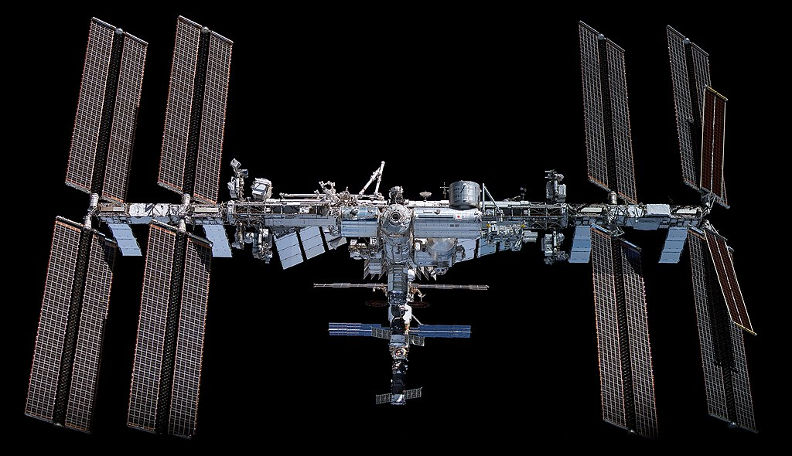

===========================
International Space Station
===========================

The International Space Station is a modular space station in low earth orbit and it provides a variety of amateur radio activities thanks to ARISS. These activities includes among others crossband repeater and regular SSTV events where you can receive pictures transmitted from the iss.

For updates on the current status and upcoming events keep an eye on their `Status Page <https://www.ariss.org/current-status-of-iss-stations.html>`_ 

Working the FM Repeater
+++++++++++++++++++++++

Working the Crossband repeater on the ISS is pretty much the same as working any other FM satellites as discussed `here <leo.html>`_. Keep in mind same operating practices and behaviour apply here as well.

Receiving SSTV Images
+++++++++++++++++++++

Every now and again ARISS along with ISS does special SSTV events. This usually means that for a specific time period the ISS will transmit special pictures (usually based on the event topic) every few minutes. You then have the opportunity over multiple passes to
listen out and decode these images. The signal is usually pretty strong and you can play along with just your handheld radio and a phone to decode the sounds. The SSTV is usually transmitted on 145.800 FM. You can also record the transmission and playback to decode
at a later time.

These were images transmitted during the  April 11 to 13th 2022 event. 

.. image:: images/sstv1.jpg
    :width: 320
    :align: left

You can use the following software to decode the sstv transmissions

.. list-table:: 
   :widths: 50 50
   :header-rows: 1

   *  - Application
      - Platform
   *  - `RX-SSTV <https://www.qsl.net/on6mu/rxsstv.htm>`_
      - PC (Windows/Linux using Wine)
   *  - `MMSSTV <https://hamsoft.ca/pages/mmsstv.php>`_
      - PC (Windows)
   *  - `QSSTV <http://users.telenet.be/on4qz/index.html>`_
      - PC (Linux/Raspberry PI)
   *  - `SSTV Blackcat <https://apps.apple.com/us/app/sstv-slow-scan-tv/id387910013>`_  
      - Mobile (IOS)
   *  - `Robot36 <https://play.google.com/store/apps/details?id=xdsopl.robot36&hl=en_ZA&gl=US>`_  
      - Mobile (Android)

