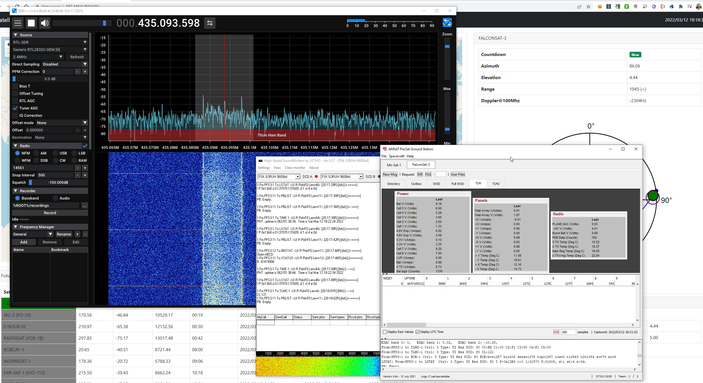

===========================
Hunting Satellite Telemetry
===========================

There are lots of satellites being launched. A lot of them from univerities and amateur radio clubs. These projects don't often have the big budget having ground stations all over the world. A fun activity for amateur radio satellite enthusiasts is to track these
satellites and receive and decode the telemetry from them. 

.. toctree::
    :maxdepth: 10
    :caption: Tutorials:

    decodingsatexample.rst

Resources
+++++++++

This is a fairly wide topic and this document will be expanded over time with information, but for now here are some interesting links to get you going

.. list-table:: 
   :widths: 50 50
   :header-rows: 1

   *  - Website
      - Notes
   *  - `Twitter List of Satellite Telemetry Hunters <https://twitter.com/i/lists/1513934221525540874>`_
      - People actively decoding telemetry and posting results
   *  - `PE0SAT Website <https://www.pe0sat.vgnet.nl/>`_
      - Lots of information regarding software and telemetry decoding
   *  - `DK3WN Satblog <https://www.satblog.info/>`_
      - | Lots of information regarding software and telemetry decoding. 
        | Mike also develops various software for receiving and decoding
        | satellite signals. 
   *  - `gr-satellites <https://github.com/daniestevez/gr-satellites>`_  
      - | A library with GNU Radio modules for decoding various different 
        | Amateur Satellites by Daniel Estevez (EA4GPZ)
   *  - `EA4GPZ Blog <https://destevez.net/>`_  
      - Lots of satellite information
   *  - `SoundModem Website <http://uz7.ho.ua/packetradio.htm>`_  
      - Software Packet Radio TNC, used for decoding many satellite signals

    

    
